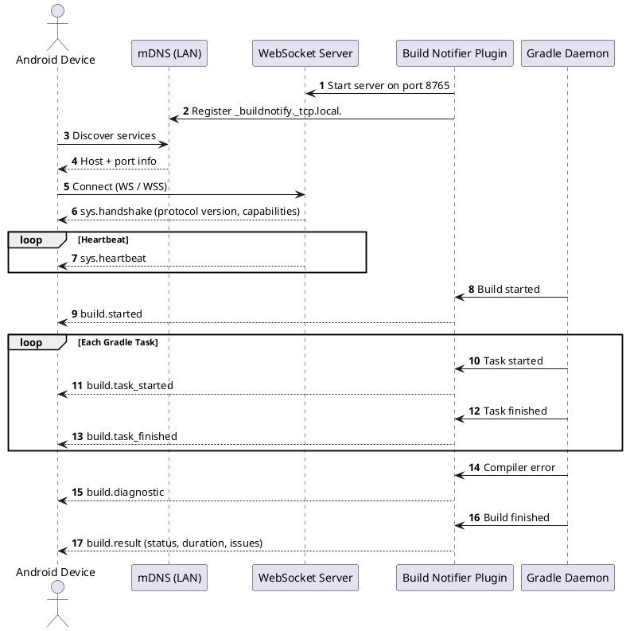
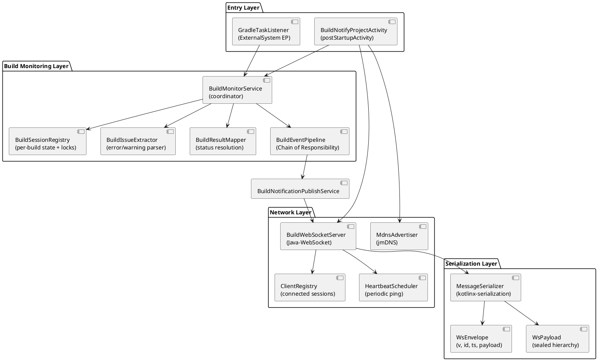

<p align="center">
  
</p>

<h1 align="center">Build Notifier</h1>

<p align="center">
  <strong>Real-time Gradle build notifications on your Android device — straight from the IDE.</strong>
</p>

<p align="center">
  
  
  
  
  <br/>
  
  
</p>

---

Build Notifier is an IntelliJ Platform plugin for **Android Studio** that streams Gradle build events to connected
Android devices over local Wi-Fi in real time. It runs a lightweight WebSocket server inside the IDE, advertises itself
via **mDNS** (zero configuration), and pushes structured JSON messages for every build lifecycle event — from task start
to final result, including compiler errors and warnings with precise file locations.

> [!NOTE]
> **This project is under active development.** APIs and the wire protocol may change between releases. The companion *
*Android mobile application** is currently being developed and will be available soon.

---

## Table of Contents

- [Features](#features)
- [How It Works](#how-it-works)
- [Architecture](#architecture)
- [Project Structure](#project-structure)
- [WebSocket Protocol](#websocket-protocol)
    - [Envelope Format](#envelope-format)
    - [Message Types](#message-types)
    - [Example Messages](#example-messages)
- [Configuration](#configuration)
- [Secure WebSocket (WSS)](#secure-websocket-wss)
- [Building from Source](#building-from-source)
- [Tech Stack](#tech-stack)
- [Roadmap](#roadmap)
- [Contributing](#contributing)
- [License](#license)

---

## Features

- **Real-time build status** — receive `SUCCESS`, `FAILED`, or `CANCELLED` the instant a Gradle build finishes
- **Compiler diagnostics** — Kotlin and Java errors and warnings with file path, line, and column
- **Task-level progress** — every Gradle task reports its start and terminal status (`RUNNING`, `SUCCESS`, `UP_TO_DATE`,
  `FAILED`, `SKIPPED`)
- **Multiple devices** — connect several phones or tablets simultaneously; all receive the same broadcast
- **Zero-config discovery** — the plugin advertises `_buildnotify._tcp.local.` via mDNS; devices find it automatically
  on the local network
- **Heartbeat keep-alive** — periodic pings prevent the OS from killing idle WebSocket connections
- **Secure connections** — optional WSS (TLS) via a user-provided JKS keystore
- **Configurable** — port, service name, heartbeat interval, notification limits, timeouts, and keystore path are all
  adjustable in **Settings → Tools → Build Notifier**
- **Protocol versioning** — handshake includes protocol version and server capabilities so clients can gracefully handle
  mismatches

---

## How It Works



**Step by step:**

1. When a project opens, `BuildNotifyProjectActivity` starts the WebSocket server and registers the mDNS service.
2. The mobile app discovers the service on the local network and opens a WebSocket connection.
3. The server immediately sends a `sys.handshake` with protocol version, instance ID, and capabilities.
4. A periodic `sys.heartbeat` keeps the connection alive between builds.
5. When the user triggers a Gradle build, the plugin captures events through two channels:
    - **Gradle task lifecycle** via `ExternalSystemTaskNotificationListener` (start, success, failure, cancel)
    - **Build event tree** via `BuildProgressListener` attached to `BuildViewManager` and `SyncViewManager`
6. Events flow through a **Chain of Responsibility** pipeline where handlers map raw IDE events to typed outgoing
   payloads.
7. The `BuildNotificationPublishService` wraps each payload in a `WsEnvelope` and broadcasts it to all connected
   clients.

---

## Architecture


The plugin follows a layered architecture with clear separation of concerns:

| Layer                | Responsibility                                                                                             |
|----------------------|------------------------------------------------------------------------------------------------------------|
| **Entry**            | Bootstraps the plugin on project open; listens for Gradle task lifecycle events                            |
| **Build Monitoring** | Coordinates build sessions, extracts diagnostics, resolves final status, runs the event pipeline           |
| **Network**          | Manages the WebSocket server, connected clients, heartbeat, and mDNS advertisement                         |
| **Serialization**    | Encodes/decodes typed JSON messages using `kotlinx-serialization` with a polymorphic `WsPayload` hierarchy |

---

## Project Structure

```
src/main/kotlin/me/yuriisoft/buildnotify/
├── BuildNotifyProjectActivity.kt      Post-startup: starts server, mDNS, wires listeners
├── BuildNotifyPluginDisposable.kt     Project-level disposable for cleanup
├── BuildNotifyBundle.kt               i18n resource bundle
│
├── build/
│   ├── GradleTaskListener.kt          ExternalSystem task lifecycle listener
│   ├── BuildMonitorService.kt         Central coordinator for build events
│   ├── BuildNotificationPublishService.kt  Maps outgoing events → WsPayload, broadcasts
│   │
│   ├── model/
│   │   ├── BuildResult.kt             Final build result data class
│   │   ├── BuildStatus.kt             Enum: STARTED, SUCCESS, FAILED, CANCELLED
│   │   └── BuildIssue.kt              Compiler diagnostic: file, line, column, message
│   │
│   ├── session/
│   │   ├── BuildSession.kt            Mutable per-build state
│   │   └── BuildSessionRegistry.kt    Thread-safe session store with per-build locks
│   │
│   ├── mapper/
│   │   ├── BuildResultMapper.kt       EventResult → BuildStatus resolution
│   │   └── BuildIssueExtractor.kt     Extracts BuildIssue from raw IDE events
│   │
│   └── pipeline/
│       ├── BuildEventPipeline.kt      Runs events through the handler chain
│       ├── BuildEventChain.kt         Chain of Responsibility dispatcher
│       ├── BuildEventContext.kt        Immutable context per event
│       ├── BuildEventHandler.kt        Handler interface
│       ├── OutgoingBuildEvent.kt       Sealed: TaskStarted, TaskFinished, Diagnostic
│       ├── TaskStatus.kt              Enum: RUNNING, SUCCESS, UP_TO_DATE, FAILED, SKIPPED
│       ├── DiagnosticSeverity.kt      Enum: ERROR, WARNING
│       └── handler/
│           ├── TaskHandlers.kt         Maps StartEvent/FinishEvent → task payloads
│           ├── DiagnosticHandlers.kt   Maps MessageEvent → diagnostic payloads
│           └── DiscardHandlers.kt      Filters out noise (OutputBuildEvent, lifecycle)
│
├── network/
│   ├── server/
│   │   ├── BuildWebSocketServer.kt    WebSocket server with optional SSL
│   │   ├── ClientRegistry.kt          Manages connected WebSocketSessions
│   │   ├── WebSocketSession.kt        Value object: id + socket + send()
│   │   └── HeartbeatScheduler.kt      Periodic heartbeat broadcaster
│   └── discovery/
│       └── MdnsAdvertiser.kt          mDNS service registration via jmDNS
│
├── serialization/
│   ├── WsEnvelope.kt                  Wire envelope: version, id, timestamp, payload
│   ├── WsPayload.kt                   Sealed payload hierarchy (all message types)
│   └── MessageSerializer.kt           JSON codec (classDiscriminator = "type")
│
└── settings/
    ├── PluginSettingsState.kt          Persistent settings (port, intervals, keystore, etc.)
    └── PluginSettingsConfigurable.kt   Settings UI: Settings → Tools → Build Notifier
```

---

## WebSocket Protocol

All communication uses JSON over WebSocket (WS or WSS). Every message in both directions is wrapped in a **`WsEnvelope`
**.

### Envelope Format

```json
{
  "v": 1,
  "id": "550e8400-e29b-41d4-a716-446655440000",
  "correlationId": null,
  "ts": 1711000000000,
  "payload": {
    "type": "build.started",
    "...": "..."
  }
}
```

| Field           | Type        | Description                                                                                       |
|-----------------|-------------|---------------------------------------------------------------------------------------------------|
| `v`             | `Int`       | Protocol major version. Clients should disconnect or downgrade UI on mismatch.                    |
| `id`            | `String`    | Sender-generated UUID. Used for deduplication on reconnects.                                      |
| `correlationId` | `String?`   | Present only in `cmd.result` — links back to the command `id` that triggered it.                  |
| `ts`            | `Long`      | Epoch milliseconds at creation time.                                                              |
| `payload`       | `WsPayload` | The typed message body. The `type` discriminator inside this object determines the concrete type. |

### Message Types

#### Server → Client

| Type                  | Payload Class            | Key Fields                                                                       | Description                                                                    |
|-----------------------|--------------------------|----------------------------------------------------------------------------------|--------------------------------------------------------------------------------|
| `sys.handshake`       | `HandshakePayload`       | `protocolVersion`, `instanceId`, `capabilities`                                  | Sent immediately on connect. Client verifies protocol compatibility.           |
| `sys.heartbeat`       | `HeartbeatPayload`       | `serverTime`                                                                     | Periodic keep-alive. Client resets its "connection lost" timer.                |
| `build.started`       | `BuildStartedPayload`    | `buildId`, `projectName`                                                         | A new Gradle build session has started.                                        |
| `build.task_started`  | `TaskStartedPayload`     | `buildId`, `projectName`, `taskPath`                                             | A Gradle task began executing.                                                 |
| `build.task_finished` | `TaskFinishedPayload`    | `buildId`, `projectName`, `taskPath`, `status`                                   | A Gradle task completed. Status: `SUCCESS`, `UP_TO_DATE`, `FAILED`, `SKIPPED`. |
| `build.diagnostic`    | `BuildDiagnosticPayload` | `buildId`, `projectName`, `severity`, `message`, `filePath?`, `line?`, `column?` | Compiler error or warning, optionally with source location.                    |
| `build.result`        | `BuildResultPayload`     | `result` (nested `BuildResult`)                                                  | Final build result with status, duration, and aggregated issues.               |
| `cmd.result`          | `CommandResultPayload`   | `status`, `errorCode?`, `message?`                                               | Response to a client command (via `correlationId`).                            |

#### Client → Server

| Type               | Payload Class        | Key Fields             | Description                                             |
|--------------------|----------------------|------------------------|---------------------------------------------------------|
| `cmd.cancel_build` | `CancelBuildCommand` | `buildId`              | Request to cancel a running build.                      |
| `cmd.run_build`    | `RunBuildCommand`    | `projectName`, `tasks` | Request to trigger a Gradle build with specified tasks. |

#### Capabilities

The `sys.handshake` message includes a `capabilities` set that tells the client what the server supports:

| Capability      | Description                                         |
|-----------------|-----------------------------------------------------|
| `BUILD_MONITOR` | Server streams build events                         |
| `BUILD_CONTROL` | Server accepts `cmd.run_build` / `cmd.cancel_build` |
| `AI_AGENT`      | Reserved for future AI agent integration            |

### Example Messages

**Handshake (server → client):**

```json
{
  "v": 1,
  "id": "a1b2c3d4-e5f6-7890-abcd-ef1234567890",
  "ts": 1711000000000,
  "payload": {
    "type": "sys.handshake",
    "protocolVersion": 1,
    "instanceId": "studio-macbook-pro-2024",
    "capabilities": [
      "BUILD_MONITOR"
    ]
  }
}
```

**Build diagnostic (server → client):**

```json
{
  "v": 1,
  "id": "b2c3d4e5-f6a7-8901-bcde-f12345678901",
  "ts": 1711000012345,
  "payload": {
    "type": "build.diagnostic",
    "buildId": "gradle-build-42",
    "projectName": "MyApp",
    "severity": "ERROR",
    "message": "Unresolved reference: foo",
    "detail": null,
    "filePath": "/src/main/kotlin/com/example/Main.kt",
    "line": 42,
    "column": 15
  }
}
```

**Build result (server → client):**

```json
{
  "v": 1,
  "id": "c3d4e5f6-a7b8-9012-cdef-123456789012",
  "ts": 1711000030000,
  "payload": {
    "type": "build.result",
    "result": {
      "buildId": "gradle-build-42",
      "projectName": "MyApp",
      "status": "FAILED",
      "durationMs": 28500,
      "errorCount": 3,
      "warningCount": 1,
      "errors": [
        {
          "filePath": "/src/main/kotlin/com/example/Main.kt",
          "line": 42,
          "column": 15,
          "message": "Unresolved reference: foo",
          "severity": "ERROR"
        }
      ],
      "warnings": [],
      "startedAt": 1711000001500,
      "finishedAt": 1711000030000
    }
  }
}
```

**Cancel build command (client → server):**

```json
{
  "v": 1,
  "id": "d4e5f6a7-b8c9-0123-defa-234567890123",
  "ts": 1711000015000,
  "payload": {
    "type": "cmd.cancel_build",
    "buildId": "gradle-build-42"
  }
}
```

---

## Configuration

All settings are accessible at **Settings → Tools → Build Notifier** in Android Studio.

| Setting                           | Default                     | Description                                                                                                            |
|-----------------------------------|-----------------------------|------------------------------------------------------------------------------------------------------------------------|
| **Port**                          | `8765`                      | WebSocket server port. Changes take effect after clicking OK (server restarts).                                        |
| **Service name**                  | `AndroidStudio-BuildNotify` | Name advertised via mDNS; shown on mobile devices during discovery.                                                    |
| **Send warnings**                 | `true`                      | Whether compiler warnings are included in notifications.                                                               |
| **Max issues per notification**   | `20`                        | Caps the number of diagnostics sent per build to avoid oversized payloads.                                             |
| **Heartbeat interval (sec)**      | `30`                        | How often connected devices are pinged to keep the connection alive.                                                   |
| **Connection lost timeout (sec)** | `30`                        | After this many seconds without a response, a connection is considered dead.                                           |
| **Stale session timeout (min)**   | `30`                        | Builds with no finish event are dropped after this time to avoid memory growth.                                        |
| **Keystore file (JKS)**           | _(empty)_                   | Absolute path to a JKS keystore for WSS. Leave empty to use `BUILDNOTIFY_KEYSTORE_PATH` env or bundled `keystore.jks`. |

Settings are persisted in `buildNotifySettings.xml` (non-roaming).

---

## Secure WebSocket (WSS)

The plugin serves plain **WS** by default. To enable **WSS** for encrypted local connections:

### 1. Generate a JKS keystore

```bash
keytool -genkeypair -alias buildnotify -keyalg RSA -keysize 2048 -storetype JKS \
  -keystore keystore.jks -validity 3650 -storepass YOUR_PASSWORD -keypass YOUR_PASSWORD \
  -dname "CN=localhost, OU=Dev, O=Dev, L=City, ST=State, C=US"
```

### 2. Provide the keystore to the plugin

Choose one of:

- Copy `keystore.jks` into `src/main/resources/` for local builds (the file is gitignored)
- Set the environment variable `BUILDNOTIFY_KEYSTORE_PATH` to an absolute path
- Set the path in **Settings → Tools → Build Notifier → Keystore file**

### 3. Set the keystore password

```bash
export BUILDNOTIFY_KEYSTORE_PASSWORD=YOUR_PASSWORD
```

Set this environment variable **before** starting the IDE. The password is never stored in plugin settings.

> [!TIP]
> If the keystore or password is missing, the server falls back to plain **WS** and logs an info-level message. No
> error, no crash — it just runs unencrypted.

---

## Building from Source

### Prerequisites

| Tool           | Version                                     |
|----------------|---------------------------------------------|
| JDK            | 21+                                         |
| Gradle         | 9.0 (included via wrapper)                  |
| Android Studio | 2024.2.1+ (Ladybug) for running the sandbox |

### Clone and build

```bash
git clone https://github.com/ArtSurzworking/build-notify-plugin.git
cd build-notify-plugin
```

```bash
# Build the plugin distribution
./gradlew buildPlugin

# Run Android Studio sandbox with the plugin installed
./gradlew runIde

# Run tests
./gradlew test

# Verify plugin compatibility
./gradlew verifyPlugin
```

The built plugin ZIP is located at `build/distributions/`.

### Pre-configured run configurations

The `.run/` directory includes ready-to-use IntelliJ run configurations:

| Configuration           | What it does                                                                         |
|-------------------------|--------------------------------------------------------------------------------------|
| **Run IDE with Plugin** | Launches `runIde` with `--debug` — starts a sandboxed Android Studio with the plugin |

---

## Tech Stack

| Component         | Technology                                                               | Version          |
|-------------------|--------------------------------------------------------------------------|------------------|
| Language          | Kotlin (JVM)                                                             | 2.1.20           |
| Platform          | IntelliJ Platform SDK                                                    | 2024.2+          |
| Build tool        | Gradle                                                                   | 9.0.0            |
| WebSocket server  | [Java-WebSocket](https://github.com/TooTallNate/Java-WebSocket)          | 1.5.6            |
| Service discovery | [jmDNS](https://github.com/jmdns/jmdns)                                  | 3.5.9            |
| Serialization     | [kotlinx-serialization](https://github.com/Kotlin/kotlinx.serialization) | 1.8.0            |
| Coroutines        | kotlinx-coroutines                                                       | 1.10.2           |
| Testing           | JUnit 5 + MockK                                                          | 5.11.0 / 1.13.12 |
| Code coverage     | Kover                                                                    | 0.9.1            |
| Static analysis   | Qodana                                                                   | 2024.3.4         |
| Changelog         | gradle-changelog-plugin + git-cliff                                      | 2.2.1            |

---

## Roadmap

- [ ] **Companion Android app** — native mobile client for receiving build notifications _(coming soon)_
- [ ] **CI/CD integration** — GitHub Actions for automated build, test, and publish
- [ ] **JetBrains Marketplace publishing** — signed and verified plugin distribution
- [ ] **Build control from mobile** — trigger and cancel builds remotely via `cmd.run_build` / `cmd.cancel_build`
- [ ] **iOS companion app** — extend support beyond Android
- [ ] **AI agent integration** — reserved `agent.*` namespace for future AI-powered build insights

---

## Contributing

Contributions are welcome! This project is in its early stages, so there is plenty of room to shape the architecture.

1. Fork the repository
2. Create a feature branch (`git checkout -b feat/my-feature`)
3. Follow [Conventional Commits](https://www.conventionalcommits.org/) for commit messages
4. Submit a pull request

Please ensure your code:

- Compiles cleanly with `./gradlew buildPlugin`
- Passes `./gradlew verifyPlugin` without errors
- Follows the existing Kotlin coding conventions

---

## License

Copyright &copy; 2026 [YuriiSoft](https://www.yuriisoft.me). All rights reserved.

Licensed under the [Apache License, Version 2.0](https://www.apache.org/licenses/LICENSE-2.0).

---

<p align="center">
  <sub>Built with the <a href="https://plugins.jetbrains.com/docs/intellij/tools-intellij-platform-gradle-plugin.html">IntelliJ Platform Gradle Plugin</a></sub>
</p>
